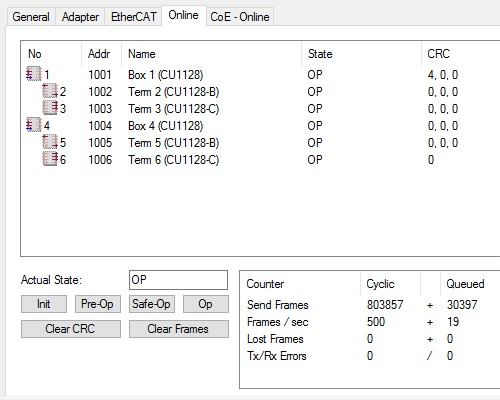
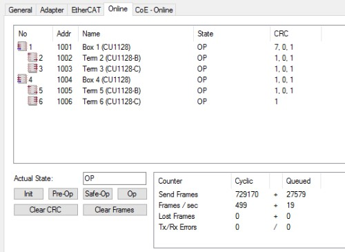
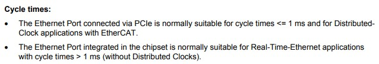

> EtherCAT CRC error between IPC and first ethercat device due to cycle time and port ethernet election

### Introduction
EtherCAT network CRC, RX, TX errors and lost frames probably happen more than we would all want and/or admit. A loose or dirty connection, a broken wire even some sort of electro/magnetic noise. It's the intermitent errors that are the hardest to debug.

The manual for the C6920 can be found [here](https://download.beckhoff.com/download/document/ipc/industrial-pc/c6920_c6925en.pdf). Beckhoff has been really slow on this one with the last update in September 2016. As we speak the latest model referenced in the documention is still available, but not recommended for new projects. This PDF needs and update!

The reason why I mention this outdated fact is my experience has to do with a C6920-0060, which is not mentioned in the pdf, so unfortunately up to some interpretation - spoiler, I got it wrong - but at least I confirmed it and fixed it.

A little background, this IPC runs a fairly large line with 100+ ethercat devices, a handful of automatically (un)loaded CNCs and conveyors going every which way. I was tasked to figure out why the ethercat network running this line had intermitent CRC errors on the ethercat frames. One would generally assume that CRC errors would be between two devices with a 20M cable or a remote IO with dynamic movement. This specific one was a CRC error between the IPC and the first ethercat device. That's a 30cm ethernet cable inside a panel floating in air with no other cables even close to it.

My initial testing had me create a new project and only scan in portions of the ethercat network to try and pinpoint location for the source of the error. I eventually ended up with just the IPC and two CU1128 connected to it as part of the ethercat network. The following pictures show the topology and also the fact that only even with these devices there were still CRC errors. They were also always on the first connection between the IPC and first CU1128, but would sometimes propagate.

### Solution
On these C6920 IPCs there are two ethernet ports, X102 and X103. One is connected via PCIe and the other is integrated. Versions before C6920-0040, the X102 was connected to PCIe and X103 integrated. Versions starting with and after (I think) the C6920-0040 have those connections flipped with the X103 being PCIe. As previously mentionned I was working on a C6920-0060, which is not explicitely mentioned in the documentation and leaves the port mapping up in the air.

During the debugging I eventually did try switching between the X102 and X103 ports, and it worked. There were no more intermitent CRC errors slowly counting up. I confirmed with Beckhoff support that the C6920-0060 had its X103 port connected via PCIe and that is the one that is currently used to this day with no issues whatsoever.

### Conclusion
Both the X102 and X103 ports support the realtime ethercat protocol and both show up in the TwinCAT RT-Ethernet adapters installation window. If you read closely in the documentation there is a mention of the different ports supporting different cycle times.

If the cycle time is at that 1ms or faster, then this becomes a real concern, otherwise either port is probably fine. The motion tasks had been reduced on the machine to 500us not long before this problem of CRC errors started happening.
