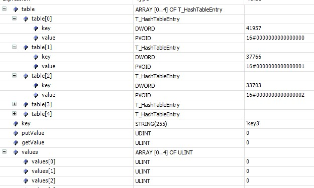
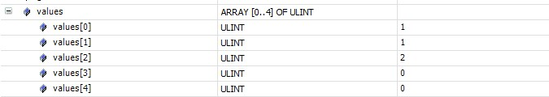
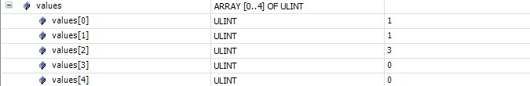
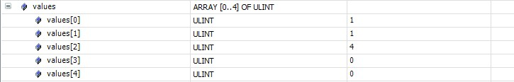
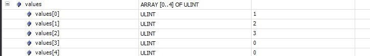
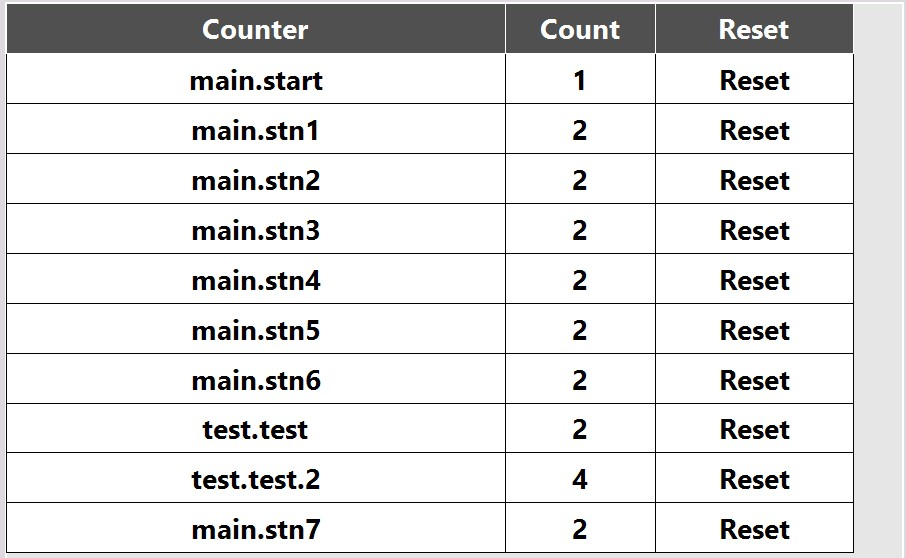

> Creating a deterministic, persistent enabled, HashTable FB which uses strings as keys

### Introduction
Beckhoff currently offers a hash table implementation in their `Tc2_Utilities` library. It uses a `DWORD` as key and `PVOID` as value. I was looking at creating an easy to use string key based counter FB that can be set as being persistent to keep track of tool life or part counter on a machine. This would mean a persistent string hash FB.

Documentation for `FB_HashTableCtrl` [here](https://infosys.beckhoff.com/english.php?content=../content/1033/tcplclibutilities/html/TcPlcLibUtilities_FB_HashTableCtrl.htm&id=) and example [here](https://infosys.beckhoff.com/english.php?content=../content/1033/tcplclib_tc2_utilities/18014398544898699.html&id=).

Looking at the example the first thing needed is the initializing of the Hash Table using `F_CreateHashTableHnd`. This function calculates all the internal pointers needed and also clears the hash of all values.

There are two problems that need to be solved here.

1. String -> dword(udint) mapping (hash)
2. Hash Table persistence

### Initial Implementation
The first problem can be solved by using the built in `F_DATA_TO_CRC16_CCITT` hash function to get an `UDINT` from the `STRING`. There is however a collision possiblity that needs to be taken into account. See [this](https://stackoverflow.com/questions/13998960/what-is-the-possibility-of-crc16-collisions-on-20-bytes-of-data) Stack Overflow post. TLDR a test using `[a-z0-9]` yielded `0.0016%` collision rate. Hopefully the PLC programmer notices that there was a collision and that two key/values are acting weird.

The second problem of persistence is a little harder to deal with since the initialization function completely clears all the hash table internals. The first workaround is to use the hash to store the index of where inside the internal array a value is stored and use that same index in an external array to store the counter value itself.

On every PLC startup the hash table will need to be reinitialized with the same keys. For persistence to work correctly there is an assumption to be made. That each unique key hash will always result in the same array index.

```typescript
PROGRAM MAIN
VAR
	state : INT;
	getPosPtr : POINTER TO T_HashTableEntry;
	fbTable : FB_HashTableCtrl;
	hTable : T_HHASHTABLE;
	table : ARRAY [0..4] OF T_HashTableEntry;
	key : STRING(255);
	putValue : UDINT;
	getValue : ULINT;
END_VAR
VAR PERSISTENT
	values : ARRAY [0..4] OF ULINT;
END_VAR

// Implementation
CASE state OF
	0:
		F_CreateHashTableHnd(ADR(table), SIZEOF(table), hTable);
		state := 1;
	10: // Insert key of all counters on all starts start to repopulate internal representation
		// Insert into hash table returning the adr of the insert
		fbTable.A_Add(key:=F_DATA_TO_CRC16_CCITT(ADR(key), TO_UDINT(len(key)), 0), putValue:=putValue, hTable:=hTable, getPosPtr=>getPosPtr);
		// Use the insert adr to find the index used
		fbTable.A_GetIndexAtPosPtr(hTable:=hTable, putPosPtr:=getPosPtr);
		// Set the value of the entry to its index inside the array
		table[fbTable.getValue].value := fbTable.getValue;
		state := 11;
	20: // We can now directly query the string hash and retrieve the index to get its counter value
		fbTable.A_Lookup(key:=F_DATA_TO_CRC16_CCITT(ADR(key), TO_UDINT(len(key)), 0), hTable := hTable);
		values[fbTable.getValue] := values[fbTable.getValue] + 1;
		state := 21;
	30:
		fbTable.A_Lookup(key := F_DATA_TO_CRC16_CCITT(ADR(key), TO_UDINT(len(key)), 0), hTable := hTable);
		getValue := values[fbTable.getValue];
		state := 31;
END_CASE
```
Currently done manually on every PLC startup set `key = keyX` and `state = 10` based on the table below and in order to insert the keys.

| key | Calculated CRC16 |
| --- | ---------------- |
| key1 | 41957 |
| key2 | 37766 |
| key3 | 33703 |

Will yield the following internal table and the secondary counter value table.



Now if I increment the counter values by setting `key = keyX` and `state = 20` a few times I get the following. This would have incremented `key1` and `key2` by 1 and `key3` by 2.



I can now stop the PLC and Activate and on startup go through the insertion of keys and increment a counter using `key = key3` and `state = 20`. This will give me the correct and expected result.



So far everything works as expected. As long as on each PLC startup the internal hash table is initialized with all the keys it works fine. I will agree it is not the most elegant solution though and can easily break.

So far on each startup I've been inserting the keys in the same order, `key1`, `key2`, `key3`. What would happen if I insert the keys in a different order and then try and incrementing a value. This time on startup the keys are inserted in the following order , `key2`, `key3`, `key1`. And now, again let's increment a counter using `key = key3` and `state = 20`.

Based on our previous testing we would expect the following.


Although what we get is this.


The way Beckhoff's hash table is implemented, there is no deterministic array index associated to each key. Each array index is associate to each key in the order of insertion with an internal counter that coresponds to the next available index. Since `key3` was inserted as the second item, `values[1]` gets incremented instead of `values[2]`.

This solution would work as long as there is a guarentee of always having the exact same quantity and insertion order of keys. That is too big of an assumption to make.

With this first version the initial requirements have been met, although there are two unfortunate side effects.

- Possibility of collision and overwritting of data (albeit very small)
- Scary immutable keys insertion requirement

### Custom FB_Hash
At this point it would be more work to try and mold the built in hash functionality to make it work versus building my own from scratch. A custom implementation will solve the two aforementioned points also allow much more versility in the future.

Firstly define a new hash item struct. The type of `value` can be changed to meet your own needs, but note to modify the `inc` function at the same time.
```typescript
TYPE ST_HashItem :
STRUCT
	key : STRING(255);
	hash : UINT;
	value : UDINT;
END_STRUCT
END_TYPE
```
Next the hash FB itself. This version has a few extra items (msg, _enDB) that are used with other functionality, but aren't important here. This FB uses Open addressing with Double (or more) hashing to solve for any collisions that may happen. See [this](https://en.wikipedia.org/wiki/Double_hashing) for more information. Looking closely at the item struct it stores the key the index hash value and the actual value. The key is used for collision detection when two keys given the same index. The result of the hash function is directly used (with array size modulo) as the index of the array to store the data in. By using the hash directly this gives deterministic hashing behavior so it can be used in a persistent setting even with out of order increments, removing and adding key.

To be exact the index is not deterministic since it can still end up at a different index if there is a collision between two keys and those two keys are inserted in different order at the initlization of the FB. This is irrelavent to the end result though. And if it is persistent then the index shall never change.

The Open addressing does run into issues with cache misses when it fills to ~80%. This FB will send a message when it reaches 80%, but it is up to the programmer to set the desired array size correctly.
```typescript
{attribute 'reflection'}
FUNCTION_BLOCK FB_Hash
VAR_INPUT
END_VAR
VAR_OUTPUT
END_VAR
VAR
	_enDB : BOOL;
	//msg : FB_TcMessage;
	dataSorted : ARRAY [1..HASHSIZE] OF POINTER TO ST_HashItem;
	data : ARRAY [1..HASHSIZE] OF ST_HashItem;
	size : UINT;
	k : UINT;
	// Keeps track of all the collisions of this FB
	collisions : UDINT;
END_VAR
VAR CONSTANT
	// To reduce collisions use a prime number as hash size
	// 101, 251, 503, 1009, 2503, 5003, 10007
	HASHSIZE : UINT := 251;
	EMPTYITEM : ST_HashItem := ();
END_VAR

// Empty Implementation
```
```typescript
// Method _sort
METHOD PROTECTED _sort : BOOL
VAR_INPUT
	first : DINT;
	last : DINT;
END_VAR
VAR
	ii : DINT;
	jj : DINT;
	pivot : DINT;
	temp : POINTER TO ST_HashItem;
END_VAR

// Implementation
IF first < last THEN
	pivot := first;
	ii := first;
	jj := last;
	
	WHILE ii < jj DO
		WHILE dataSorted[ii]^.key <= dataSorted[pivot]^.key AND_THEN ii < last  DO
			ii := ii + 1;
		END_WHILE
		WHILE dataSorted[jj]^.key > dataSorted[pivot]^.key DO
			jj := jj - 1;
		END_WHILE
		IF ii < jj THEN
			temp := dataSorted[ii];
			dataSorted[ii] := dataSorted[jj];
			dataSorted[jj] := temp;
		END_IF
	END_WHILE
	
	temp := dataSorted[pivot];
	dataSorted[pivot] := dataSorted[jj];
	dataSorted[jj] := temp;
	THIS^._sort(first, jj - 1);
	THIS^._sort(jj + 1, last);
END_IF
```
```typescript
// Method clear
METHOD clear : BOOL
VAR_INPUT
END_VAR
VAR
	ii : UINT;
END_VAR

// Implementation
size := 0;
FOR ii := 1 TO HASHSIZE DO
	dataSorted[ii] := ADR(EMPTYITEM);
	data[ii].key := '';
	data[ii].hash := 0;
	data[ii].value := 0;
END_FOR
clear := TRUE;
```

```typescript
// Method FB_init
METHOD FB_init : BOOL
VAR_INPUT
	bInitRetains : BOOL; // if TRUE, the retain variables are initialized (warm start / cold start)
	bInCopyCode : BOOL;  // if TRUE, the instance afterwards gets moved into the copy code (online change)
	enDB : BOOL;
END_VAR
VAR
	ii : UINT;
END_VAR

// Implementation
_enDB := enDB;
FOR ii := 1 TO HASHSIZE DO
	dataSorted[ii] := ADR(EMPTYITEM);
END_FOR
// Call release to help if the FB is made persistent
//msg.Release();
```

```typescript
// Method get
METHOD get : UDINT
VAR_INPUT
	key : STRING(255);
END_VAR
VAR
	ii : UINT;
END_VAR

// Implementation
IF key = '' THEN
	//msg.CreateEx(TC_Events.HashEventClass.EmptyKey, 0);
	//msg.Send(0);
ELSE
	key := F_ToLCase(key);
	FOR ii := 1 TO HASHSIZE DO
		k := hash(key, ii-1);
		IF data[k].key = key THEN
			get := data[k].value;
			EXIT;
		ELSIF data[k].key = '' THEN
			//msg.CreateEx(TC_Events.HashEventClass.KeyError, 0);
			//msg.ipArguments.Clear().AddString(key);
			//msg.Send(0);
			EXIT;
		// ELSE
			// Collision, hash again
		END_IF
	END_FOR
END_IF
```

```typescript
// Method hash
METHOD PROTECTED hash : UINT
VAR_INPUT
	key : STRING(255);
	off : UINT;
END_VAR

// Implementation
hash := F_DATA_TO_CRC16_CCITT(ADR(key), TO_UDINT(len(key)), off);
hash := hash MOD HASHSIZE;
```

```typescript
// Method inc
METHOD inc : UDINT
VAR_INPUT
	key : STRING(255);
END_VAR

// Implementation
inc := get(key);
IF inc = 0 THEN
	set(key, 1);
	inc := 1;
ELSE
	inc := data[k].value := data[k].value + 1;
END_IF
```

```typescript
// Method remove
METHOD remove : UDINT
VAR_INPUT
	key : STRING(255);
END_VAR
VAR
	ii : UINT;
END_VAR

// Implementation
remove := get(key);
IF remove <> 0 THEN
	size := size - 1;
	// Find where this key was stored in the sorted keys
	FOR ii := 1 TO HASHSIZE DO
		IF dataSorted[ii] <> 0 AND_THEN dataSorted[ii]^.key = key THEN
			EXIT;
		END_IF
	END_FOR
	// Fill the empty spot if needed
	IF ii < HASHSIZE THEN
		MEMCPY(ADR(dataSorted[ii]), ADR(dataSorted[ii+1]), SIZEOF(dataSorted[1]) * size);
	END_IF
	dataSorted[HASHSIZE] := ADR(EMPTYITEM);

	// Reset the entry
	data[k].key := '';
	data[k].hash := 0;
	data[k].value := 0;
END_IF
```

```typescript
// Method reset
METHOD reset : UDINT
VAR_INPUT
	key	: STRING(255);
END_VAR

// Implementation
reset := get(key);
IF reset <> 0 THEN
	{IF defined (variable: DB.Pool)}
	IF _enDB THEN
		DB.Pool.exec2(ADR(DB.qryCounter), TRUE, F_STRING(data[k].key), F_UDINT(data[k].value));
	END_IF
	{END_IF}
	data[k].value := 0;
END_IF
```

```typescript
// Method set
METHOD set : BOOL
VAR_INPUT
	key : STRING(255);
	val : UDINT;
END_VAR
VAR
	ii : UINT;
END_VAR

// Implementation
IF key = '' THEN
	//msg.CreateEx(TC_Events.HashEventClass.EmptyKey, 0);
	//msg.Send(0);
ELSE
	key := F_ToLCase(key);
	FOR ii := 1 TO HASHSIZE DO
		k := hash(key, ii-1);
		IF data[k].key = key THEN
			data[k].value := val;
			set := TRUE;
			EXIT;
		ELSIF data[k].key = '' THEN
			data[k].key := key;
			data[k].hash := k;
			data[k].value := val;
			size := size + 1;
			IF size > HASHSIZE * 0.8 THEN
				IF size = HASHSIZE THEN
					//msg.CreateEx(TC_EVENTS.HashEventClass.FillLimitError, 0);
				ELSE
					//msg.CreateEx(TC_EVENTS.HashEventClass.FillLimitWarn, 0);
				END_IF
				//msg.send(0);
			END_IF
			IF ii > 1 THEN
				collisions := collisions + ii - 1;
				//msg.CreateEx(TC_EVENTS.HashEventClass.InsertCollision, 0);
				//msg.ipArguments.Clear().AddUInt(ii-1);
				//msg.send(0);
			END_IF
			set := TRUE;
			EXIT;
		// ELSE
			// Collision
		END_IF
	END_FOR
END_IF
```

```typescript
// Method sort
METHOD PROTECTED sort : BOOL
VAR_INPUT
END_VAR

// Implementation
IF size > 1 THEN
	sort := _sort(1, size - 1);
END_IF
```

Now the main program.
```typescript
PROGRAM MAIN
VAR
	key : STRING(255);
	putval : UDINT;
	getval : UDINT;
	state : INT;
END_VAR
VAR PERSISTENT
	hash : FB_Hash(enDb:=FALSE);
END_VAR

// Implementation
CASE state OF
	10:
		// Push int as value
		hash.set(key, putval);
		state := 11;
	20:
		// Increment value
		hash.inc(key);
		state := 21;
	30:
		// Get value
		getval := hash.get(key);
		state :=31;
END_CASE
```

With this new hash algorithm, insert the same three string values and the calculated index done by the `hash` method above.

| key | Calculated index |
| --- | ---------------- |
| key1 | 40 |
| key2 | 116 |
| key3 | 69 |

By having the FB defined as persistent, it works as expected. After each startup all the keys and values are still present and there will never be any collision or overwritting of data.

### How to Use
It is also ridicioulsy easy to use this FB. In your PLC code at the end of a cycle you could increment each tool counter and the station counter like so. There's even no need to call `set` before `inc`, as `inc` will start from 0 if not found (alhtough it will issue a warning).
```typescript
VAR_GLOBAL PERSISTENT
	CNT : FB_Hash(enDb:=FALSE);
END_VAR

// In each station have its instancePath defined with {attribute 'reflection'} (this is a subject for another post)
CNT.inc(instancePath); // Equivalent to CNT.inc('MAIN.station1');
CNT.inc('MAIN.station1.tool1'); //CNT.inc(CONCAT(instancePath, '.tool1'));
CNT.inc('MAIN.station1.tool2');
CNT.inc('MAIN.station1.tool3');
```
And on the HMI have a button linked to the reset method. If you have a database connection, it will also automatically push it up.
```typescript
CNT.reset('MAIN.station1.tool3');
```

### Quick Sort
As a bonus this FB also implements a quick sort to be used in conjunction with the `dataSorted` array. This array is used for display purposes on the HMI. Since the hashing algorithm used does not place data in sequential order, there needs to be a way to condense it down to a sequential array for presenting on the HMI. The `sort` method does exactly that.

Here's an example HMI table, which automatically displays all counters in the FB and gives the operator reset functionality. 


### Conclusion
And here I was happy to have found a default implementation of a Hash Table inside a Beckhoff library. It was too good to be true. For simple non persistent use cases the default Hash Table is likely sufficient - I even use it elsewhere.

This custom FB_Hash is just a lot nicer and easier to use and works if made persistent. I call it beautiful counting.
