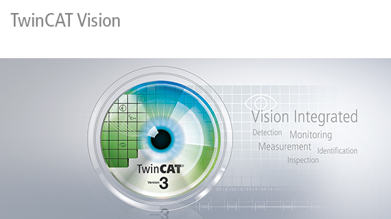
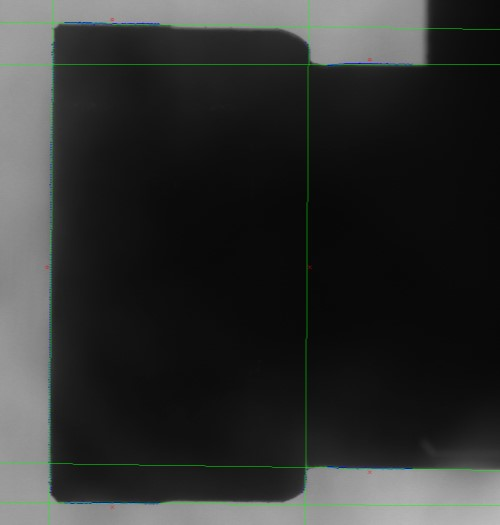

> First steps into Beckhoff's newly released TC3 Vision. Setting up basic metrology using the provided functions and simplifying them using custom structs, functions and FBs.

Since Beckhoff first started talking about having vision capabilities in TwinCAT a few years ago, I've been waiting in anticipation to see what it would bring. Most of the camera inspections I work with are simple due to the geometry and also the physical setup. Currently this is achieved using smart cameras that are interfaced over some sort of industrial protocol.

Having a separate smart camera requires yet another engineering software tool to learn and use and have available and the added complexity of interfacing yet another third party device. Bringing the engineering setup into the same tool as the rest of the PLC development would streamline things.

The TwinCAT vision is API based versus having a GUI. The provided API has many filter functions (Gaussian, Laplace, Scharr, Sobel, Bilateral, etc) and can be quite powerful if your application needs it and you know your image processing. They do include basic measurement functions that should be sufficient for most basic metrology needs. These functions are `LocatedEdge`, `LocateEllipse`, `LocationCircularEdge`, `MeasureEdgeDistance`, `MeasureAngleBetweenEdges`, `ClosestPointBF`. They will require some basic parameterization, and doing this will likely take a little longer than having a GUI for point and click definitions.


You can find the vision documentation pdf [here](https://download.beckhoff.com/download/document/automation/twincat3/TF7000-TF7300_TC3_Vision_en.pdf).


### Background
Let's start with the final image with all found edges displayed. The red O is the start of the search line and the red X the end. The green lines are the best fit line while the blue X are the matched points. The original is 2500x2000px hence the small markups. You can grab the raw version [here](./images/geometry.jpg).



In a typical smart camera setup this would be very quick and easy to setup. Pretty much by dragging and dropping three separate measurement tools onto the image and sizing them correctly.

### Initial Implementation
This initial implementation is based on Beckhoff's locate edge example [code](https://infosys.beckhoff.com/content/1033/tf7xxx_tc3_vision/Resources/zip/9007204658470539.zip). The aforementioned PDF has step by step example on getting started on page 23. After playing around with the major parameters I was able to get all edges to be found and measured. THe documentation is very complete and it does into details in explaining the parameters using in all edge finding algorithms.

> The search direction is between `aStartPoint` and `aEndPoint` and the search width is `nSearchLines*fSearchLineDist` px wide.

All code in this post has been tested and works. If you grab all the parts it will compile, however the project configuration and any potential variable linking will be missing.

```typescript
PROGRAM MAIN
VAR
	hr : HRESULT;
	hrFunc : HRESULT;
	fbCamera : FB_VN_SimpleCameraControl;
	eState : ETcVnCameraState;

	ipImageIn : ITcVnImage;
	ipImageInDisp : ITcVnDisplayableImage;
	ipImageRes : ITcVnImage;
	ipImageResDisp : ITcVnDisplayableImage;

	// result
	edge209Start : ITcVnContainer;
	edge209Stop : ITcVnContainer;
	d209LineStart : TcVnVector4_LREAL;
	d209LineStop : TcVnVector4_LREAL;
	d209Dist : REAL;
	edge222Start : ITcVnContainer;
	edge222Stop : ITcVnContainer;
	d222LineStart : TcVnVector4_LREAL;
	d222LineStop : TcVnVector4_LREAL;
	d222Dist : REAL;
	edge201Start : ITcVnContainer;
	edge201Stop : ITcVnContainer;
	d201LineStart : TcVnVector4_LREAL;
	d201LineStop : TcVnVector4_LREAL;
	d201Dist : REAL;

	// parameters
	d209Start : TcVnPoint2_REAL := [245, 795];
	d209Stop : TcVnPoint2_REAL := [245, 1770];
	d222Start : TcVnPoint2_REAL := [760, 875];
	d222Stop : TcVnPoint2_REAL := [760, 1700];
	d201Start : TcVnPoint2_REAL := [115, 1290];
	d201Stop : TcVnPoint2_REAL := [640, 1290];
	eDirection : ETcVnEdgeDirection := TCVN_ED_LIGHT_TO_DARK;
	fMinStrength : REAL := 50;
	nSearchLines : UDINT := 95;
	fSearchLineDist : REAL := 2;
	nMaxThickness : UDINT := 10;
	fSearchGap : REAL := 0;
	fApproxPrecision : REAL := 0.01;
	nSubpixIter : UDINT := 10;
	eAlgorithm : ETcVnEdgeDetectionAlgorithm := TCVN_EDA_INTERPOLATION;

	nSearchLines201 : UDINT := 181;
	fSearchLineDist201 : REAL := 5;
	nMaxThickness201 : UDINT := 10;
	nSearchLines222 : UDINT := 85;
	fSearchLineDist222 : REAL := 2;

	// Watchdog
	hrWD : HRESULT;
	tStop : DINT := 15000; // Task time set to 20ms
	tRest : DINT;
	nFraction : UDINT;

	// drawing
	aColorGreen : TcVnVector4_LREAL := [0, 255, 0];
	aColorBlue : TcVnVector4_LREAL := [0, 0, 255];
	aColorRed : TcVnVector4_LREAL := [255, 0, 0];
END_VAR

// Implementation
eState := fbCamera.GetState();
CASE eState OF
TCVN_CS_INITIAL, TCVN_CS_OPENING, TCVN_CS_OPENED, TCVN_CS_STARTACQUISITION:
	hr := fbCamera.StartAcquisition();
TCVN_CS_ACQUIRING:
	hr := fbCamera.GetCurrentImage(ipImageIn);
	IF SUCCEEDED(hr) AND ipImageIn <> 0 THEN
		hrWD := F_VN_StartRelWatchdog(tStop, hr);
			hrFunc := F_VN_MeasureEdgeDistanceExp(
				ipSrcImage:= ipImageIn,
				fAvgDistance:= d209Dist,
				aStartPoint:= d209Start,
				aEndPoint:= d209Stop,
				eEdgeDirection:= eDirection,
				fMinStrength:= fMinStrength,
				nSearchLines:= nSearchLines,
				fSearchLineDist:= fSearchLineDist,
				nMaxThickness:= nMaxThickness,
				bInvertSearchDirection:= FALSE,
				fSearchGap:= fSearchGap,
				nSubpixelsIterations:= nSubpixIter,
				fApproxPrecision:= fApproxPrecision,
				eAlgorithm:= eAlgorithm,
				ipEdgePoints1:= edge209Start,
				ipEdgePoints2:= edge209Stop,
				ipDistances:= 0,
				hrPrev:=hr
			);
			hrFunc := F_VN_MeasureEdgeDistanceExp(
				ipSrcImage:= ipImageIn,
				fAvgDistance:= d201Dist,
				aStartPoint:= d201Start,
				aEndPoint:= d201Stop,
				eEdgeDirection:= eDirection,
				fMinStrength:= fMinStrength,
				nSearchLines:= nSearchLines201,
				fSearchLineDist:= fSearchLineDist201,
				nMaxThickness:= nMaxThickness201,
				bInvertSearchDirection:= FALSE,
				fSearchGap:= fSearchGap,
				nSubpixelsIterations:= nSubpixIter,
				fApproxPrecision:= fApproxPrecision,
				eAlgorithm:= eAlgorithm,
				ipEdgePoints1:= edge201Start,
				ipEdgePoints2:= edge201Stop,
				ipDistances:= 0,
				hrPrev:=hr
			);
			hrFunc := F_VN_MeasureEdgeDistanceExp(
				ipSrcImage:= ipImageIn,
				fAvgDistance:= d222Dist,
				aStartPoint:= d222Start,
				aEndPoint:= d222Stop,
				eEdgeDirection:= eDirection,
				fMinStrength:= fMinStrength,
				nSearchLines:= nSearchLines222,
				fSearchLineDist:= fSearchLineDist222,
				nMaxThickness:= nMaxThickness,
				bInvertSearchDirection:= FALSE,
				fSearchGap:= fSearchGap,
				nSubpixelsIterations:= nSubpixIter,
				fApproxPrecision:= fApproxPrecision,
				eAlgorithm:= eAlgorithm,
				ipEdgePoints1:= edge222Start,
				ipEdgePoints2:= edge222Stop,
				ipDistances:= 0,
				hrPrev:=hr
			);
		hrWD := F_VN_StopWatchdog(hrWD, nFractionProcessed=>nFraction, tRest=>tRest);
		// Draw result for visualization
		hr := F_VN_ConvertColorSpace(ipImageIn, ipImageRes, TCVN_CST_GRAY_TO_RGB, hr);

		hr := F_VN_DrawPoint(REAL_TO_UDINT(d209Start[0]), REAL_TO_UDINT(d209Start[1]), ipImageRes, TCVN_DS_CIRCLE, aColorRed, hr);
		hr := F_VN_DrawPoint(REAL_TO_UDINT(d209Stop[0]), REAL_TO_UDINT(d209Stop[1]), ipImageRes, TCVN_DS_X, aColorRed, hr);
		hr := F_VN_FitLine(edge209Start, d209LineStart, hr);
		hr := F_VN_DrawLine_TcVnVector4_LREAL(d209LineStart, ipImageRes, aColorGreen, 1, hr);
		hr := F_VN_DrawPointsExp(edge209Start, ipImageRes, TCVN_DS_PLUS, aColorBlue, 1, 1, TCVN_LT_8_CONNECTED, hr);
		hr := F_VN_FitLine(edge209Stop, d209LineStop, hr);
		hr := F_VN_DrawLine_TcVnVector4_LREAL(d209LineStop, ipImageRes, aColorGreen, 1, hr);
		hr := F_VN_DrawPointsExp(edge209Stop, ipImageRes, TCVN_DS_PLUS, aColorBlue, 1, 1, TCVN_LT_8_CONNECTED, hr);

		hr := F_VN_DrawPoint(REAL_TO_UDINT(d222Start[0]), REAL_TO_UDINT(d222Start[1]), ipImageRes, TCVN_DS_CIRCLE, aColorRed, hr);
		hr := F_VN_DrawPoint(REAL_TO_UDINT(d222Stop[0]), REAL_TO_UDINT(d222Stop[1]), ipImageRes, TCVN_DS_X, aColorRed, hr);
		hr := F_VN_FitLine(edge222Start, d222LineStart, hr);
		hr := F_VN_DrawLine_TcVnVector4_LREAL(d222LineStart, ipImageRes, aColorGreen, 1, hr);
		hr := F_VN_DrawPointsExp(edge222Start, ipImageRes, TCVN_DS_PLUS, aColorBlue, 1, 1, TCVN_LT_8_CONNECTED, hr);
		hr := F_VN_FitLine(edge222Stop, d222LineStop, hr);
		hr := F_VN_DrawLine_TcVnVector4_LREAL(d222LineStop, ipImageRes, aColorGreen, 1, hr);
		hr := F_VN_DrawPointsExp(edge222Stop, ipImageRes, TCVN_DS_PLUS, aColorBlue, 1, 1, TCVN_LT_8_CONNECTED, hr);

		hr := F_VN_DrawPoint(REAL_TO_UDINT(d201Start[0]), REAL_TO_UDINT(d201Start[1]), ipImageRes, TCVN_DS_CIRCLE, aColorRed, hr);
		hr := F_VN_DrawPoint(REAL_TO_UDINT(d201Stop[0]), REAL_TO_UDINT(d201Stop[1]), ipImageRes, TCVN_DS_X, aColorRed, hr);
		hr := F_VN_FitLine(edge201Start, d201LineStart, hr);
		hr := F_VN_DrawLine_TcVnVector4_LREAL(d201LineStart, ipImageRes, aColorGreen, 1, hr);
		hr := F_VN_DrawPointsExp(edge201Start, ipImageRes, TCVN_DS_PLUS, aColorBlue, 1, 1, TCVN_LT_8_CONNECTED, hr);
		hr := F_VN_FitLine(edge201Stop, d201LineStop, hr);
		hr := F_VN_DrawLine_TcVnVector4_LREAL(d201LineStop, ipImageRes, aColorGreen, 1, hr);
		hr := F_VN_DrawPointsExp(edge201Stop, ipImageRes, TCVN_DS_PLUS, aColorBlue, 1, 1, TCVN_LT_8_CONNECTED, hr);

		// Display source and result image
		hr := F_VN_TransformIntoDisplayableImage(ipImageIn, ipImageInDisp, S_OK);
		hr := F_VN_TransformIntoDisplayableImage(ipImageRes, ipImageResDisp, S_OK);
	END_IF
TCVN_CS_ERROR:
	hr := fbCamera.Reset();
END_CASE
```

### Make it DRY
Given that Structured Text does not allow overloading function calls or defining default input parameters (like a FB), the above example is very heavy and convoluted. Mostly when most of the inputs we pass are actually just the recommended default values.

We can rectify this by using structs with default values and pass them to helper functions by reference. This struct will hold all input parameters and also all return values. It should be considered a full single representation of a measurement to be done.

```typescript
TYPE ST_DimBase :
STRUCT
	// Config
	name : STRING(255);

	// Must be set. Default values will return errors
	pFrom : TcVnPoint2_REAL := [-1, -1];
	pTo1 : TcVnPoint2_REAL := [-1, -1];
	pTo2 : TcVnPoint2_REAL := [-1, -1]; // Used for angle
	lines : UDINT := 0;

	// Can use defaults
	dir : ETcVnEdgeDirection := TCVN_ED_LIGHT_TO_DARK;
	minStr : REAL := 50;
	lineDist : REAL := 1;
	maxThick : UDINT := 10;
	gap : REAL := 0;
	precision : REAL := 0.001; // 0.01 - 0.0001
	subpix : UDINT := 10; // 5-10 for INTER, 50-100 for ERF/Gaussian
	invDir : BOOL := FALSE;
	algorithm : ETcVnEdgeDetectionAlgorithm := TCVN_EDA_INTERPOLATION;
	degrees : BOOL := TRUE; // Used for angle

	// Results
	result : REAL;
	results : ITcVnContainer; // Used for distance
	edgeFrom : ITcVnContainer;
	edgeTo : ITcVnContainer;
	lineFrom : TcVnVector4_LREAL;
	lineTo : TcVnVector4_LREAL;
END_STRUCT
END_TYPE
```

Now to make calling the underlying `F_VN_MeasureEdgeDistanceExp` function easily by creating a higher level helper function. This function can also set the `gap` parameter automatically if the input gap value is less than zero. The gap parameter reduces processing time by skipping all the pixels in between the start and end points. Notice that is uses a `REFERENCE TO ST_DimBase` as input. This will allow to pass the variable directly, but will act as pass by reference and allow the function to set the return values inside the struct.
```typescript
FUNCTION F_Dist : HRESULT
VAR_INPUT
	dim : REFERENCE TO ST_DimBase;
	img : ITcVnImage;
END_VAR

// Implementation
IF dim.gap < 0 THEN
	// If gap less than zero auto calculate based on largest diff between x/y and set to 90%
	dim.gap := MAX(ABS(dim.pTo1[0] - dim.pFrom[0]), ABS(dim.pTo1[1] - dim.pFrom[1])) * 0.9;
END_IF
F_Dist := F_VN_MeasureEdgeDistanceExp(
	ipSrcImage:=img,
	fAvgDistance:=dim.result,
	aStartPoint:=dim.pFrom,
	aEndPoint:=dim.pTo1,
	eEdgeDirection:=dim.dir,
	fMinStrength:=dim.minStr,
	nSearchLines:=dim.lines,
	fSearchLineDist:=dim.lineDist,
	nMaxThickness:=dim.maxThick,
	bInvertSearchDirection:=dim.invDir,
	fSearchGap:=dim.gap,
	nSubpixelsIterations:=dim.subpix,
	fApproxPrecision:=dim.precision,
	eAlgorithm:=dim.algorithm,
	ipEdgePoints1:=dim.edgeFrom,
	ipEdgePoints2:=dim.edgeTo,
	ipDistances:=dim.results,
	hrPrev:=S_OK
);
```

Now to draw the results onto the image. Again the same `ST_DimBase` structure as input. This function will try and draw everything it can even if data is missing/incorrect.
```typescript
FUNCTION F_DimDraw : HRESULT
VAR_INPUT
	dim : REFERENCE TO ST_DimBase;
	img : ITcVnImage;
END_VAR
VAR
	hr : HRESULT;
	green : TcVnVector4_LREAL := [0, 255, 0, 0];
	blue : TcVnVector4_LREAL := [0, 0, 255, 0];
	red : TcVnVector4_LREAL := [255, 0, 0, 0];
END_VAR

// Implementation

IF dim.pFrom[0] >= 0 AND_THEN dim.pFrom[1] >= 0 THEN
	hr := F_VN_DrawPoint(TO_UDINT(dim.pFrom[0]), TO_UDINT(dim.pFrom[1]), img, TCVN_DS_CIRCLE, red, hr);
END_IF
IF dim.pTo1[0] >= 0 AND_THEN dim.pTo1[1] >= 0 THEN
	hr := F_VN_DrawPoint(TO_UDINT(dim.pTo1[0]), TO_UDINT(dim.pTo1[1]), img, TCVN_DS_X, red, hr);
END_IF
IF dim.pTo2[0] >= 0 AND_THEN dim.pTo2[1] >= 0 THEN
	hr := F_VN_DrawPoint(TO_UDINT(dim.pTo2[0]), TO_UDINT(dim.pTo2[1]), img, TCVN_DS_X, red, hr);
END_IF

IF F_VN_CheckIfEmpty(dim.edgeFrom, S_OK) = S_FALSE THEN
	hr := F_VN_DrawPointsExp(dim.edgeFrom, img, TCVN_DS_PLUS, blue, 1, 1, TCVN_LT_8_CONNECTED, hr);
	hr := F_VN_FitLine(dim.edgeFrom, dim.lineFrom, hr);
	hr := F_VN_DrawLine_TcVnVector4_LREAL(dim.lineFrom, img, green, 1, hr);
END_IF

IF F_VN_CheckIfEmpty(dim.edgeTo, S_OK) = S_FALSE THEN
	hr := F_VN_DrawPointsExp(dim.edgeTo, img, TCVN_DS_PLUS, blue, 1, 1, TCVN_LT_8_CONNECTED, hr);
	hr := F_VN_FitLine(dim.edgeTo, dim.lineTo, hr);
	hr := F_VN_DrawLine_TcVnVector4_LREAL(dim.lineTo, img, green, 1, hr);
END_IF

F_DimDraw := hr;
```

Now if we use these new blocks the previous `MAIN` can be rewritten into something more concise by covering up all the unnecessary configuration options and repetition. It is important to note that there is no loss of functionality. All inputs into the function are accessible if desired.
```typescript
PROGRAM MAIN
VAR
	hr : HRESULT;
	hrFunc : HRESULT;
	fbCamera : FB_VN_SimpleCameraControl;
	eState : ETcVnCameraState;

	ipImageIn : ITcVnImage;
	ipImageInDisp : ITcVnDisplayableImage;
	ipImageRes : ITcVnImage;
	ipImageResDisp : ITcVnDisplayableImage;

	// Watchdog
	hrWD : HRESULT;
	tStop : DINT := 15000;
	tRest : DINT;
	nFraction : UDINT;

	// parameters
	dimDist : ARRAY [0..2] OF ST_DimBase := [
		(name:='d201', pFrom:=[115, 1290], pTo1:=[640, 1290], lines:=181, lineDist:=5),
		(name:='d209', pFrom:=[245, 795], pTo1:=[245, 1770], lines:=95, lineDist:=2),
		(name:='d222', pFrom:=[760, 875], pTo1:=[760, 1700], lines:=85, lineDist:=2)
	];
END_VAR

// Implementation
eState := fbCamera.GetState();
CASE eState OF
TCVN_CS_INITIAL, TCVN_CS_OPENING, TCVN_CS_OPENED, TCVN_CS_STARTACQUISITION:
	hr := fbCamera.StartAcquisition();
TCVN_CS_ACQUIRING:
	hr := fbCamera.GetCurrentImage(ipImageIn);
	IF SUCCEEDED(hr) AND ipImageIn <> 0 THEN
		hrWD := F_VN_StartRelWatchdog(tStop, hr);
			hrFunc := F_Dist(dimDist[0], ipImageIn);
			hrFunc := F_Dist(dimDist[1], ipImageIn);
			hrFunc := F_Dist(dimDist[2], ipImageIn);
		hrWD := F_VN_StopWatchdog(hrWD, nFractionProcessed=>nFraction, tRest=>tRest);

		hr := F_VN_ConvertColorSpace(ipImageIn, ipImageRes, TCVN_CST_GRAY_TO_RGB, hr);

		F_DimDraw(dimDist[0], ipImageRes);
		F_DimDraw(dimDist[1], ipImageRes);
		F_DimDraw(dimDist[2], ipImageRes);

		// Display source and result image
		hr := F_VN_TransformIntoDisplayableImage(ipImageIn, ipImageInDisp, S_OK);
		hr := F_VN_TransformIntoDisplayableImage(ipImageRes, ipImageResDisp, S_OK);
	END_IF
TCVN_CS_ERROR:
	hr := fbCamera.Reset();
END_CASE
```

### Turn it into a FB
Now this is already a lot better and much more manageable, however there are still a few pain points to this.
- A lot of setup and control code around the measurements and camera
- Still need to manually optimize how many vision functions to run in a single cycle (Never allow using more than the cycle time)

These two points can be fixed by creating a higher level function block to hide the inner workings. This FB still uses the struct and helper functions defined earlier.

```typescript
FUNCTION_BLOCK FB_Camera
VAR_IN_OUT
	dimDist : ARRAY [*] OF ST_DimBase;
END_VAR
VAR_OUTPUT
END_VAR
VAR
	hr : HRESULT;
	hrFunc : HRESULT;
	hrWD : HRESULT;

	camera : FB_VN_SimpleCameraControl;
	camState : ETcVnCameraState;

	imgIn : ITcVnImage;
	imgInDisp : ITcVnDisplayableImage;
	imgOut : ITcVnImage;
	imgOutDisp : ITcVnDisplayableImage;

	state : INT;
	preempt : DINT;
	remain : DINT;
	complete : UDINT;
	ii : DINT;
	upper : DINT;
	lower : DINT;
END_VAR

// Implementation
camState := camera.GetState();
CASE state OF
	0:
		lower := LOWER_BOUND(dimDist, 1);
		upper := UPPER_BOUND(dimDist, 1);
		// Allow up to 80% of the cycle time to be used
		preempt := TO_DINT(0.08 * TO_LREAL(_TaskInfo[GETCURTASKINDEXEX()].CycleTime));
		state := 10;
	10:
		CASE camState OF
			TCVN_CS_INITIAL, TCVN_CS_OPENING, TCVN_CS_OPENED, TCVN_CS_STARTACQUISITION:
				hr := camera.StartAcquisition();
			TCVN_CS_ACQUIRING:
				hr := camera.GetCurrentImage(imgIn);
				IF SUCCEEDED(hr) AND_THEN imgIn <> 0 THEN
					ii := lower;
					state := 110;
				END_IF
		END_CASE
	110:
		FOR ii := ii TO upper DO
			hrWD := F_VN_StartAbsWatchdog(preempt, S_OK);
			hrFunc := F_Dist(dimDist[ii], imgIn);
			hrWD := F_VN_StopWatchdog(hrWD, nFractionProcessed=>complete, tRest=>remain);
			IF FAILED(hrFunc) OR_ELSE FAILED(hrWD) THEN
				// Send message
			END_IF
			IF complete <> 100 AND_THEN SUCCEEDED(hrFunc) THEN
				EXIT;
			ELSIF ii = upper THEN
				state := 200;
				EXIT;
			ELSIF remain < 1000 THEN
				// Less than 1ms left in task, if starting a new function will likely not complete
				ii := ii + 1;
				EXIT;
			END_IF
		END_FOR
	200:
		hr := F_VN_ConvertColorSpace(imgIn, imgOut, TCVN_CST_GRAY_TO_RGB, hr);
		FOR ii := lower TO upper DO
			F_DimDraw(dimDist[ii], imgOut);
		END_FOR

		hr := F_VN_TransformIntoDisplayableImage(imgIn, imgInDisp, S_OK);
		hr := F_VN_TransformIntoDisplayableImage(imgOut, imgOutDisp, S_OK);
		state := 300;
	300:
		// Wait to measure again. Go to state 10
END_CASE

IF camState = TCVN_CS_ERROR THEN
	hr := camera.Reset();
END_IF
```

Now the `MAIN` becomes ridiculously simple. Obviously this is a little contrived since there is functionality missing - start, stop, done, reset, etc.
```typescript
PROGRAM MAIN
VAR
	camera : FB_Camera;
	dimDist : ARRAY [0..2] OF ST_DimBase := [
		(name:='d201', pFrom:=[115, 1290], pTo1:=[640, 1290], gap:=-1, lines:=181, lineDist:=5),
		(name:='d209', pFrom:=[245, 795], pTo1:=[245, 1770], gap:=-1, lines:=95, lineDist:=2),
		(name:='d222', pFrom:=[760, 875], pTo1:=[760, 1700], gap:=-1, lines:=85, lineDist:=2)
	];
END_VAR

// Implementation
camera(dimDist := dimDist);
```

The beauty of this function block is that it allows you to easily configure your measurements as an array of structs of variable length and passing it to the camera instance. It will also automatically manage running the vision functions inside the alloted task cycle time and taking the necessary number of cycles to finish to 100%. To do it it finds the current task cycle time and allows starting new vision functions up to 80% of that cycle, it then allows the PLC to finish the cycle on the next cycle it continues with where it had left off.

### Conclusion
Beckhoff Vision is definitely a feature that I will continue playing with and look forward to trying out in a future project which requires some simple inline metrology. At this time however it is still fairly convoluted and opaque giving it a potentially steep learning curve. This is mostly due to not having a GUI configuration tool and being solely API based (except for some basic camera setup).

Pros:
- Directly integrated into the TwinCAT development environment
- No need for yet another field bus connection (or even DIO) to a smart camera
- Free development and testing using the 7-day trial licenses
- High level of fine control and functionality built in allowing advanced use
- Allows the creation of custom image processors and filters for the ever more advanced user
- I'm assuming cheaper to get a dumb camera and license than a smart camera, mostly if using more than one camera

Cons:
- Potentially frustrating and steep learning curve for users who are used to having a GUI (a la smart camera)
- Longer development time. It is much quicker to draw a box around an item then figure out pixel counts
- Limited basic feature set making it hard to use unless you're an image processing expert or doing something fairly simple
- Convoluted syntax (although as seen here, there are workarounds)

In part 2 of this vision series I will continue working on `FB_Camera` to clean it up and add some of the missing functionality.
