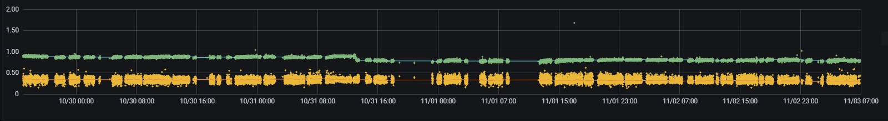
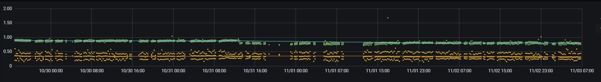
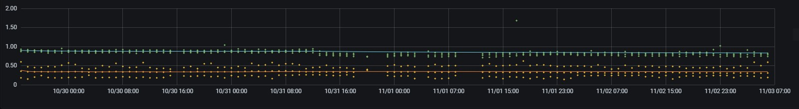
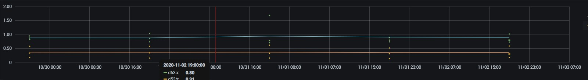
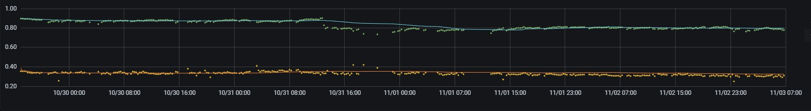

> Using Timescale Continuous Aggregates and auto switching between them for quickly and efficiently displaying time series metrics in Grafana with automatic trend line calculation while preventing loss of data information and misleading visualizations

### Introduction
As the manufacturing industry continues the shift to IoT with massive amounts of time series data being collected there have to be user friendly ways to visualize and use this data to prevent it from uselessly sitting there forever. In this post I will be working with a production machine running an 8 second cycle with inline camera inspection. Each part has 20 measured dimensions that are pushed to a PostgreSQL database. Compared to the IT and Software world, these up to 11 thousand rows of data per day is probably considered low volume.

There are multiple ways this data can be used and visualized. On the production floor operators and shift leads can visualize each new data point in realtime and hsitory to use for [Statistical Process Control](https://en.wikipedia.org/wiki/Statistical_process_control). Showing individual data points (dimension measurements) over the last few hours on a large monitor beside the line.

At the same time engineering and quality need to be able to access all of this information and be able to zoom/pan in/out for longer trend analysis or historical values. When zooming out and showing days or weeks worth of data it obviously makes no sense to show every single data point as a larger picture is needed. At this point the use of [Descriptive Statistics](https://en.wikipedia.org/wiki/Descriptive_statistics) to aggregate this data into manageable amounts to visualize is needed.

There are obviously many different ways to aggregate data. Ideally during aggregation the loss of information is minimized as much as possible. The easiest, and probably most well known way of doing this is with the [Arithmetic Mean](https://en.wikipedia.org/wiki/Arithmetic_mean) or what everyone calls the mean or the average. By only using the average a lot of potential information about the data is lost. A better approach would be to use the [Five Number Summary](https://en.wikipedia.org/wiki/Five-number_summary), its extension the [Seven Number Summary](https://en.wikipedia.org/wiki/Seven-number_summary) or some sort of combination with custom statistics.

The goal here isn't to store highly accurate and descriptive statistics about the raw data as the raw data is kept forever and always accessible for whatever statistic needs to be computed at a later date. The aim here is threefold:

1. Good user experience with extremely fast data visualization
2. Data visualization that is descriptive and not misleading when zoomed out
3. Minimize required server computation and network use for displaying data

The good people at Timescale wrote a blog post about [Speeding up Grafana with Auto Switching](https://blog.timescale.com/blog/speed-up-grafana-autoswitching-postgresql/) on which this is based. I highly recommend you take a look at it before continuing here. By using this method the above points 1 and 3 are satisfied. Using [Continuous Aggregates](https://docs.timescale.com/latest/using-timescaledb/continuous-aggregates) stores the calculated statistical values in defined time buckets which we can then be queried efficiently and quickly.

In that post they utilize time buckets of 1 hour and 1 day to visualize the total count of a metric. In their continuous aggregates there is only one calculated field (count). The statistic of `count(data)` can be replaced in this case with statistic `avg(data)`, but this would not fulfil point 2 above.

Initially, the goal was to use the Five Number Summary, but unfortunately Timescale does not currently support [ordered set aggregates](https://docs.timescale.com/latest/using-timescaledb/continuous-aggregates#future-work) in continuous aggregates. Therefore the final result ended up using the minimum, average, and maximum values. For this specific use case this seemed to be sufficient.

### Visualizaing Data with no Aggregation
All the screenshots used in this post display the same time range of about 5 days. Here's what the full data would look like without any aggregation. This is approximately 30k data points per series for a total of 60k. Increasing the time range to one month and adding more graphs to a dashboard will require fetching over a million rows. When zooming out to such a large time range individual points just end up blurring each other out and add no value to the visualization.



Therefore a reduction of data is required, but at the same time satisfying point 2 above. That is the user should be able to take away similar if not exact same conclusions regardless if using a reduced aggregated series or the original series.

### Auto Swiching between Continuous Aggregates
Again using the same time range as before, below are three versions using different calculated time buckets. The first graph shows 15 minute buckets with 350 rows, the second shows 1 hour buckets with 100 rows and the third shows 1 day buckets with 5 rows. The actual amount of points drawn is more since each bucket window has the minimum, average, and maximum value displayed for row in each series.







Given this 5 day time range, there seems to be an obvious choice as to which time bucket size should be used for display purposes. The 15 minute bucket. The information the user can get from the full data points and the 15 minute bucket is nearly identical and is not misleading, and this is the goal. The best part being that this was achieved using only 3% of original data. That is 350 rows with 3 data points each, versus 30k raw data points.

The 1 hour and 1 day buckets are too sparse given the short time frame, but given a wider time frame, say one month or half a year, they will then come in handy.

### Why not only use an Average
Instead of using the minimum, average, and maximum values for each bucket, the easier and quicker approach would have been to only use the average. There might have been some storage savings, but with Timescale's built in [Native Compression](https://docs.timescale.com/latest/using-timescaledb/compression) with up to 95% compression, this really isn't much of an issue. However, the main reason is to avoid misleading the user by displaying incomplete data.

In this specific process, outliers are rare and if they do happen they are still relatively close to the other values and would just be averaged into a time bucket and be lost. This goes against the general consensus about using the average as it is normally strongly [affected by outliers](https://www.statology.org/how-do-outliers-affect-the-mean/). This can be seen at date time 11/03 15:00 in the green data series below. The other obvious difference is by having the minimum and maximum included the spread of the data is shown on the graph. Spread, and the standard deviation, is a very important measure of a process capability. By only using the average the yellow series looks similar to the green series, just shifted. However by including the spread information on the visualization it becomes very obvious that the two series are actually behaving quite differently. Only including the average would actually be misleading. One can write many posts about how statistics, even more so single statistics, can be misleading. Always try and understand what the calculated statistic is doing to your data.




### Let's get Coding
Now let's get into implementation specifics on how this all works and is put together. The code shown here is a subset of the actual table/data used, but is sufficient for this example. Start with a standard PostgreSQL table and turn it into a Timescale [Hypertable](https://docs.timescale.com/latest/using-timescaledb/hypertables).

```sql
create table parts
(
    id integer not null,
    ts timestamp with time zone not null default now(),
    d53a double precision,
    d53b double precision,
    d56a double precision,
    d56b double precision
);
select create_hypertable('parts', 'ts');
```

Create the three continuous aggregates with the different time bucket lengths of 15 minutes, 1 hour, and 1 day. The trick here is to store the minimum, average, and maximum into an array for each series. This will make it much easier to graph inside Grafana in later steps as a single series and in a single color as the column name will be same. This could obviously be extended to however many statistical calculations inside each array.

```sql
create view parts_15m
with (timescaledb.continuous, timescaledb.refresh_interval = '15 min') as
select
	time_bucket('15 min', ts) as bkt,
	array[min(d53a), avg(d53a), max(d53a)] as "d53a",
	array[min(d53b), avg(d53b), max(d53b)] as "d53b",
	array[min(d56a), avg(d56a), max(d56a)] as "d56a",
	array[min(d56b), avg(d56b), max(d56b)] as "d56b"
from parts
group by bkt;

create view parts_1h
with (timescaledb.continuous, timescaledb.refresh_interval = '1 hour') as
select
	time_bucket('1 hour', ts) as bkt,
	array[min(d53a), avg(d53a), max(d53a)] as "d53a",
	array[min(d53b), avg(d53b), max(d53b)] as "d53b",
	array[min(d56a), avg(d56a), max(d56a)] as "d56a",
	array[min(d56b), avg(d56b), max(d56b)] as "d56b"
from parts
group by bkt;

create view parts_1d
with (timescaledb.continuous, timescaledb.refresh_interval = '1 day') as
select
	time_bucket('1 day', ts) as bkt,
	array[min(d53a), avg(d53a), max(d53a)] as "d53a",
	array[min(d53b), avg(d53b), max(d53b)] as "d53b",
	array[min(d56a), avg(d56a), max(d56a)] as "d56a",
	array[min(d56b), avg(d56b), max(d56b)] as "d56b"
from parts
group by bkt;
```

Define a helper function to unnest these arrays and calculate their average. This will be used for displaying trend lines inside Grafana. If trend lines are not needed, this function can be omitted.

```sql
create or replace function array_avg(_data anyarray)
returns numeric as $$
    select avg(a)::numeric
    from unnest(_data) as a
$$ immutable language sql;
```

Inside the Grafana dashboard there are four user changeable variables that are created. These variables allow the user to change the smoothness of the trend line and also from which continuous aggregate values are taken from given the selected time range.

| Name | Default | Description |
|------|---------|-------------|
| trend | 100 | Number of preceding data points to average |
| 15m | 1 day | Use the 15 minute bucket for time ranges between this and next |
| 1h | 20 days | Use the 1 hour bucket for time ranges between this and next |
| 1d | 90 days | Use the 1 day bucket for any time range larger than this|


Finally the Grafana dashboard query itself. It may seem a little convoluted, but is fairly simple. Each query between the `union` returns the same information, but from a different continuous aggregate and this is based on the variables above and the selected time range.

The last two columns in each query are the calculated trend lines. These can be removed if unwanted.

```sql
select
  ts as "time",
  d53a,
  d53b,
  avg(d53a) over (order by ts rows $trend preceding) as "d53a trend",
  avg(d53b) over (order by ts rows $trend preceding) as "d53b trend"
from parts
where
    $__timeTo()::timestamp - $__timeFrom()::timestamp < '$15m'::interval and
    $__timeFilter(ts)
union
select
    bkt,
    unnest(d53a),
    unnest(d53b),
    avg(array_avg(d53a)) over (order by bkt rows $trend preceding),
    avg(array_avg(d53b)) over (order by bkt rows $trend preceding)
from public.parts_15m
where
    $__timeTo()::timestamp - $__timeFrom()::timestamp >= '$15m'::interval and
    $__timeTo()::timestamp - $__timeFrom()::timestamp < '$1h'::interval and
    $__timeFilter(bkt)
union
select
    bkt,
    unnest(d53a),
    unnest(d53b),
    avg(array_avg(d53a)) over (order by bkt rows $trend preceding),
    avg(array_avg(d53b)) over (order by bkt rows $trend preceding)
from public.parts_1h
where
    $__timeTo()::timestamp - $__timeFrom()::timestamp >= '$1h'::interval and
    $__timeTo()::timestamp - $__timeFrom()::timestamp < '$1d'::interval and
    $__timeFilter(bkt)
union
select
    bkt,
    unnest(d53a),
    unnest(d53b),
    avg(array_avg(d53a)) over (order by bkt rows $trend preceding),
    avg(array_avg(d53b)) over (order by bkt rows $trend preceding)
from public.parts_1d
where
    $__timeTo()::timestamp - $__timeFrom()::timestamp >= '$1d'::interval and
    $__timeFilter(bkt)
order by 1 desc
```

### Conclusion
This implementation satisfies all three requirements of quick, efficient, and meaningful data visualization using Grafana and Timescale. It is also relatively easy to implement. Using this auto scaling with other types of data will potentially need different time buckets and switching levels, but the process is the same.

The Grafana dashboard showing this data has four graph panels. Using this solution in the five day time range, loading of the dashboard was reduced from approximately 5 long seconds to under 300ms. The user now has near instant interactions with the dashboard for the best possible user experience and also not getting mislead by overly simplifying the data.
